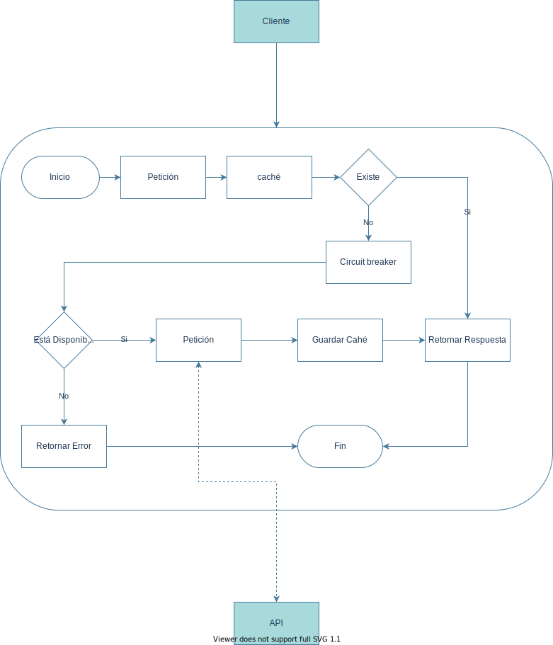

# Propuesta de solución para Hackathon Ceiba 2021

## Descripción de la solución 

Como solución al problema indicado se propuso implementar los patrones de **cache** y **circuit breaker**. 

La solucion a este problema estuvo orientada en conseguir el mejor rendimiento posible maximizando asi el número de peticiones por segundo y minimizando el número de errores y la latencia

## Drivers que orientan la toma de decisiones para la solución propuesta

Rendimiento (RPS, error rate, latency)

## Diagrama de solución 

